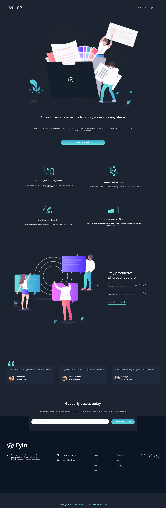
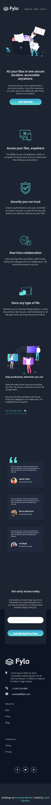
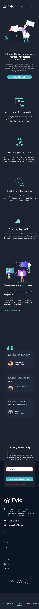

# Frontend Mentor - Fylo dark theme landing page solution

This is a solution to the [Results summary component challenge on Frontend Mentor](https://www.frontendmentor.io/challenges/fylo-dark-theme-landing-page-5ca5f2d21e82137ec91a50fd/hub). Frontend Mentor challenges help you improve your coding skills by building realistic projects. 

###Welcome 👋😎

## Overview

### The challenge

Users should be able to:

- View the optimal layout for the site depending on their device's screen size
- See hover states for all interactive elements on the page

### Screenshot

### Links

- Solution URL: https://github.com/lizSilva27/fylo_Dark_Landing_Page-FrontendMentor
- Live Site URL: https://fylodark-landingpage-ftm.netlify.app

## My process

### Built with

- Semantic HTML5 markup
- CSS custom properties
- Flexbox
- CSS Grid

## Author

- GitHub - https://github.com/lizSilva27
- Frontend Mentor - https://www.frontendmentor.io/profile/lizSilva2
